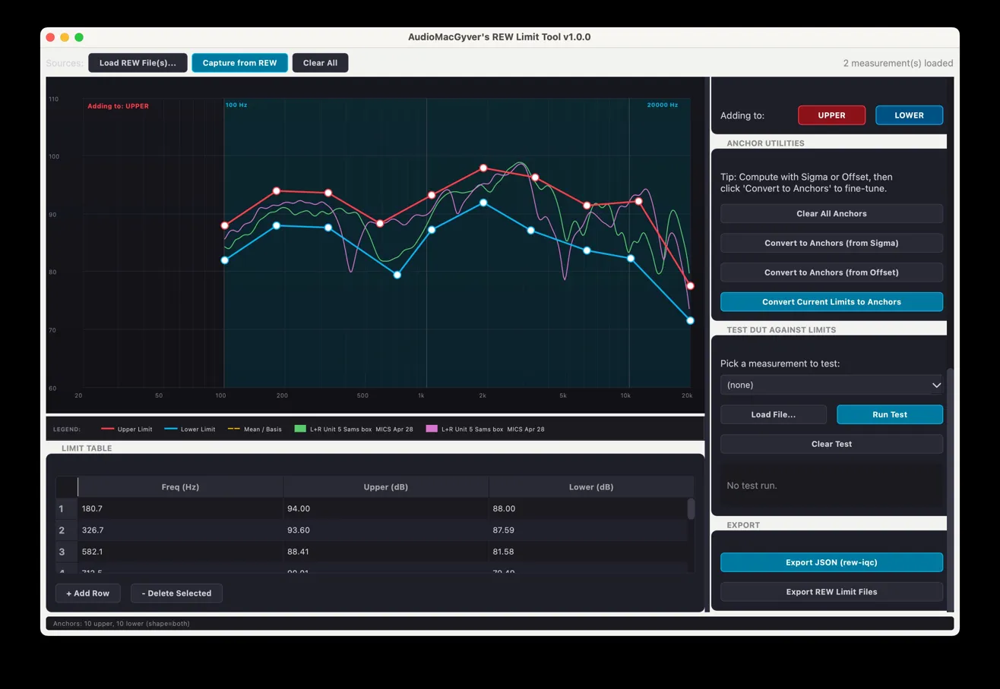
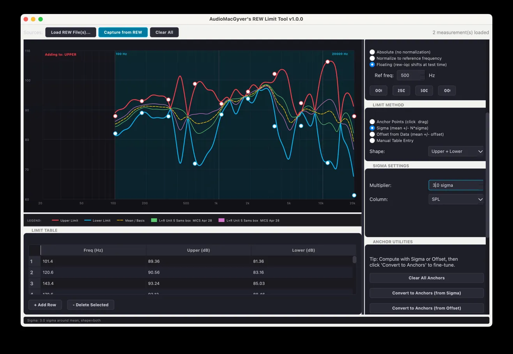
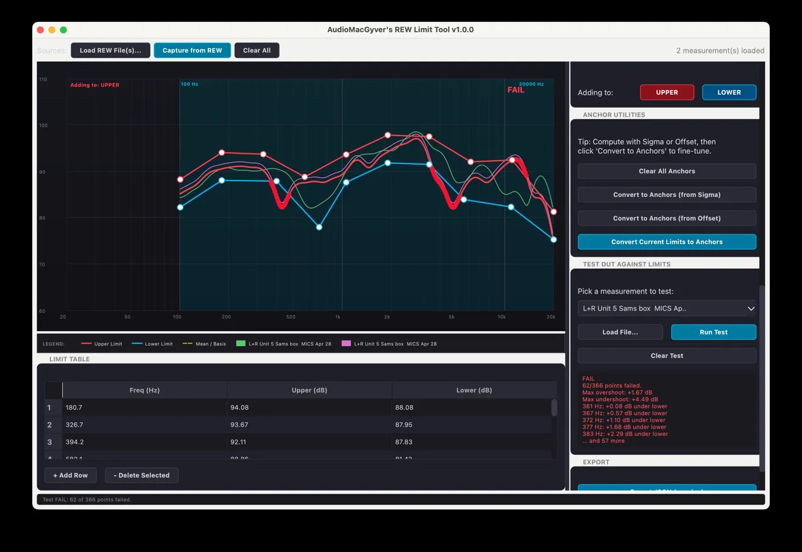
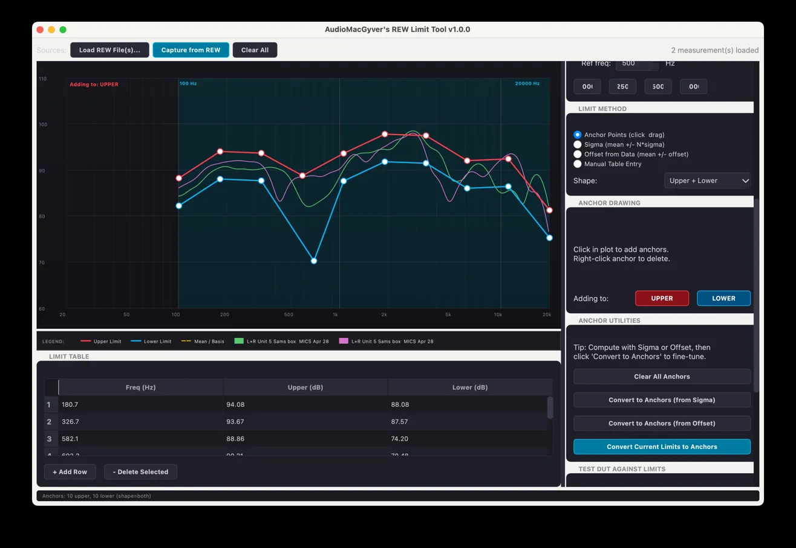

# AudioMacGyver's REW Limit Tool

**v1.1.0** — A FabFilter-inspired GUI for building factory IQC PASS/FAIL limit masks from REW (Room EQ Wizard) measurements. Designed to integrate with the [rew-iqc](https://github.com/audiomacgyver/rew-iqc) factory tool.



## What's new in v1.1.0

The tool now builds limits for three measurement types in a single session:

- **FR (Magnitude)** — frequency response in dB SPL, the original feature
- **THD** — Total Harmonic Distortion in % (uses REW's pre-aggregated THD column, default H2–H9)
- **HOHD** — Higher-Order Harmonic Distortion in % (sqrt-sum-of-squares of user-selected harmonics, default H10–H15)

The three workspaces sit in tabs at the top of the window. Sources (Load REW Files / Capture from REW / Clear All) are loaded once at the window level and shared across all three tabs. The new **Export Combined JSON (rew-iqc)** button assembles all three sections into a single mask file. THD and HOHD are optional — if you only build FR limits, the export contains just the FR section, and rew-iqc skips THD/HOHD checks at evaluation time.

## Features

- **Three tabs** — FR / THD / HOHD, each with independent plot, anchors, table, and method state
- **Load measurements** from REW text exports (`.txt`) or capture live via REST API from a running REW instance
- **Four limit creation methods**, switchable on the fly:
  - **Anchor points** — click in the plot to drop anchors, drag to shape, right-click to delete
  - **Sigma** — mean ± N·σ from a batch of reference units
  - **Offset from data** — mean ± fixed dB or % offset (no statistics required)
  - **Manual table** — type values directly
- **Three normalization modes** for unit-to-unit sensitivity variation (FR tab only):
  - **Absolute** — limits as measured
  - **Normalize to reference frequency** — every curve is shifted so it reads 0 dB at a chosen frequency
  - **Floating** — limits are tagged as floating; rew-iqc shifts the DUT at test time
- **Limit shapes**: Upper + Lower (default for FR), Upper Only (default for THD/HOHD), or Lower Only
- **Fractional-octave smoothing** with energy-domain averaging (1/48 through 1 octave)
- **User-selectable harmonics** on THD and HOHD tabs with quick-preset buttons (H2–H9 for THD, H10–H15 for HOHD)
- **Build limits around** the mean of all measurements OR a specific reference unit
- **Test DUT against limits** — load any measurement, click Run Test, see PASS/FAIL with annotated failure points
- **Hybrid workflow** — compute statistical limits then convert them to draggable anchor points for fine-tuning
- **Combined JSON export** — single file with FR + THD + HOHD sections matching the rew-iqc schema

## Screenshots

### Anchor mode with Upper / Lower toggle


### Sigma mode with floating normalization


### Pass/Fail testing a DUT


### Hybrid workflow — sigma → anchors for fine-tuning


## Installation

Requires Python 3.7+ and these packages:

```bash
pip install PyQt5 numpy
```

If you're on the older Python 3.7 that ships with Qualcomm's ADK Toolkit, pin the older PyQt5 versions that have prebuilt wheels:

```bash
pip install PyQt5==5.15.2 PyQt5-sip==12.8.1 numpy
```

## Usage

```bash
python3 rew_limits_gui.py
```

### Typical workflow for sigma-based limits

1. Measure 5–10 reference units in REW with both magnitude sweep and distortion analysis enabled
2. Open the tool, click **Capture from REW** (requires REW v5.40+ with the API enabled in Preferences → API)
3. Select all your golden units in the dialog and click **Import Selected**

#### FR tab (always required)

4. Set **Smoothing** to `1/12 octave` (or whatever resolution you want)
5. Choose your **Normalization** mode (Floating is good for sensitivity-tolerant limits)
6. Set **Frequency Range** to the band you care about (e.g., 100 Hz – 10 kHz)
7. Pick **Sigma** as the limit method, set Multiplier to e.g. 3.0
8. Optionally click **Convert Current Limits to Anchors** and drag points to fine-tune problem areas

#### THD tab (optional)

9. Switch to the THD tab — your samples' THD% curves should appear automatically
10. The default frequency range is 200 Hz – 10 kHz with Upper Only shape and units in %
11. Pick **Offset from Data** or **Sigma** to build the upper ceiling
12. The HARMONICS panel shows H2–H9 by default (matching what REW aggregates into its THD column). This list is recorded in the JSON for traceability.

#### HOHD tab (optional)

13. Switch to the HOHD tab — your samples' aggregated HOHD curves appear if REW computed the higher harmonics
14. If the plot is empty, REW probably isn't reporting H10+. Either configure REW to compute higher harmonics, or change the harmonic selection in the HARMONICS panel to a band REW does compute (e.g., uncheck H10–H15 and check H4–H9 instead)
15. Build the upper ceiling the same way as THD

#### Export

16. Click **Export Combined JSON (rew-iqc)** at the top of the window. The exported JSON includes whichever tabs have data. FR is always required; THD and HOHD are optional.

17. Use **Test DUT Against Limits** in any tab to validate the limits work on a known-good unit before committing the mask to the production line.

### Connecting to REW

The tool talks to REW's REST API on `http://localhost:4735` by default. To enable the API in REW:

1. **REW → Preferences → API**
2. Check **Enable API server**
3. Restart REW if it's the first time

Distortion data requires REW's distortion analysis to run as part of the sweep — confirm by checking that the measurement in REW shows harmonics in its Distortion view before capturing.

### Output formats

**Combined JSON for rew-iqc** — one file, three optional sections, full metadata for traceability:

```json
{
  "name": "Limits from 10 measurements",
  "version": "1.2",
  "smoothing": "1/12",
  "ppo": 48,
  "freq_range_hz": [100, 20000],
  "limits": [
    {"freq_hz": 100.0, "upper_db": 92.5, "lower_db": 84.1},
    ...
  ],
  "thd_limits": {
    "freq_range_hz": [200, 10000],
    "ppo": 12,
    "harmonics": ["H2", "H3", "H4", "H5", "H6", "H7", "H8", "H9"],
    "limits": [
      {"freq_hz": 200, "max_thd_pct": 5.0},
      ...
    ]
  },
  "hohd_limits": {
    "freq_range_hz": [200, 8000],
    "ppo": 12,
    "harmonics": ["H10", "H11", "H12", "H13", "H14", "H15"],
    "limits": [
      {"freq_hz": 200, "max_hohd_pct": 1.0},
      ...
    ]
  },
  "metadata": {
    "exported_by": "AudioMacGyver's REW Limit Tool v1.1.0",
    "source_files": ["unit_01", "unit_02", ...],
    "fr": { "method": "sigma", "shape": "both", "normalization": "floating", ... },
    "thd": { "method": "offset", "shape": "upper", ... },
    "hohd": { "method": "offset", "shape": "upper", ... }
  }
}
```

The schema mirrors what `rew_iqc.py` reads. See the top-level [README.md](../README.md#limit-mask-format) for the full field reference.

**REW limit files** — per-tab `.txt` files (`<name>_upper.txt`, `<name>_lower.txt`) you can import into REW for visual overlay. Use the **Export REW Limit Files** button inside the active tab.

## Tips

- Anchors can be added on top of any computed limit. Compute with sigma, click **Convert Current Limits to Anchors**, then drag individual points to lift problematic frequency regions
- The yellow dashed "Mean / Basis" line in the plot shows whatever curve your limits are wrapped around — useful when comparing different basis choices
- Right-click an anchor to delete it. Middle-click or double-click an anchor to reset its position
- The **Frequency Range** spinboxes also gate which limits get exported — anything outside that band is omitted from the JSON
- HOHD math is sqrt-sum-of-squares of the checked harmonics. If REW reports H_n in percent (which it does when the API is queried with `unit=percent`), then `HOHD = sqrt(H_a² + H_b² + ... + H_n²)` is the standard total-distortion formula applied to the high-harmonic subset
- REW only computes harmonics it can isolate without aliasing. For a 192 kHz sample rate you can get clean H9 up to ~10 kHz; higher harmonics need either a lower sweep stop or a higher sample rate

## Author

Built by Jesse Lippert ([@audiomacgyver](https://github.com/audiomacgyver)) for embedded audio QC work on smart glasses products.

## License

MIT
